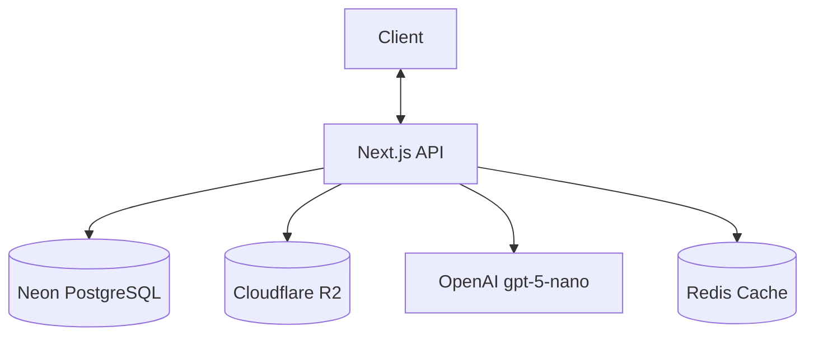
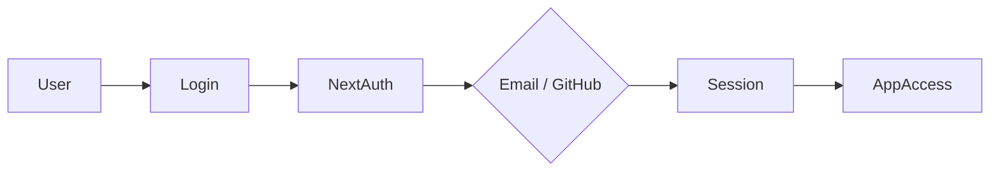
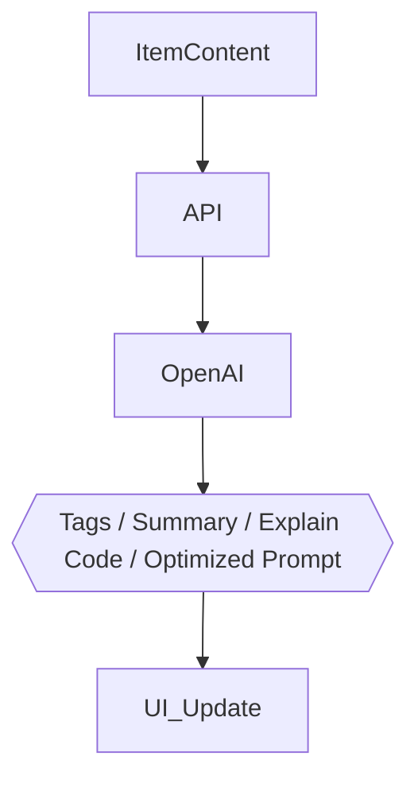

# DevStash Project Specifications

🚀 **Centralized Developer Knowledge Hub** for code snippets, AI prompts, notes, commands, files, images & links.

---

## 📌 Problem (Core Idea)

Developers keep their essentials scattered:

- Code snippets in VS Code or Notion
- AI prompts in chats
- Context files buried in projects
- Useful links in bookmarks
- Docs in random folders
- Commands in `.txt` files
- Project templates in GitHub gists
- Terminal commands in bash history

This creates **context switching, lost knowledge** and **inconsistent workflows**.

➡️ **DevStash provides ONE fast, searchable, AI‑enhanced hub for all dev knowledge & resources.**

---

## 🧑‍💻 Users

| Persona                    | Needs                                              |
| -------------------------- | -------------------------------------------------- |
| Everyday Developer         | Fast access to snippets, prompts, commands, links  |
| AI‑First Developer         | Store prompts, contexts, workflows, system messages |
| Content Creator / Educator | Save code blocks, explanations, course notes       |
| Full‑Stack Builder         | Patterns, boilerplates, API examples               |

---

## ✨ Core Features

### A) Items & Item Types

Items have a type. We start with these **system types** (fixed, cannot be changed):

| Type    | Content Kind | Availability |
| ------- | ------------ | ------------ |
| Snippet | text         | Free         |
| Prompt  | text         | Free         |
| Note    | text         | Free         |
| Command | text         | Free         |
| Link    | url          | Free         |
| File    | file         | **Pro only** |
| Image   | file         | **Pro only** |

- **Custom types** for Pro users (will come later)
- A type's content kind is `text` (snippet, note, …), `url` (link) or `file` (file, image)
- Type URLs follow the pattern: `/items/snippets`
- Items are quick to access and create within a **drawer**

### B) Collections

Users can create collections holding items of **any type**. An item can belong to **multiple collections** (e.g., a React snippet in both "React Patterns" and "Interview Prep").

Examples:

- React Patterns (snippets, notes)
- Context Files (files)
- Python Snippets (snippets)

### C) Search

Powerful search across:

- Content
- Tags
- Titles
- Types

### D) Authentication

- Email + Password
- GitHub OAuth

### E) Additional Features

- Collection & item favorites
- Pin items to top
- Recently used
- Import code from a file
- Markdown editor for text types
- File uploads for file types (file/image)
- Export data in different formats (JSON / ZIP)
- Dark mode (default for devs)
- Add/remove items to/from multiple collections
- View which collections an item belongs to

### F) AI Superpowers (Pro only)

- AI auto‑tag suggestions
- AI summaries
- AI "Explain This Code"
- Prompt optimizer

> AI powered by **OpenAI gpt-5-nano**

---

## 🗄️ Data Model (Rough Prisma Draft)

> This schema is a starting point and **will evolve**

```prisma
model User {
  id                   String   @id @default(cuid())
  email                String   @unique
  password             String?  // null for OAuth-only users
  isPro                Boolean  @default(false)
  stripeCustomerId     String?
  stripeSubscriptionId String?

  items       Item[]
  itemTypes   ItemType[]
  collections Collection[]
  tags        Tag[]

  createdAt DateTime @default(now())
  updatedAt DateTime @updatedAt
}

model Item {
  id          String  @id @default(cuid())
  title       String
  contentType String  // text | file
  content     String? // text content, null if file
  fileUrl     String? // R2 URL, null if text
  fileName    String? // original filename
  fileSize    Int?    // bytes
  url         String? // for link types
  description String?
  isFavorite  Boolean @default(false)
  isPinned    Boolean @default(false)
  language    String? // optional, for code

  userId String
  user   User @relation(fields: [userId], references: [id])

  typeId String
  type   ItemType @relation(fields: [typeId], references: [id])

  collections ItemCollection[]
  tags        ItemTag[]

  createdAt DateTime @default(now())
  updatedAt DateTime @updatedAt
}

model ItemType {
  id       String  @id @default(cuid())
  name     String
  icon     String?
  color    String?
  isSystem Boolean @default(false)

  userId String? // null for system types
  user   User?   @relation(fields: [userId], references: [id])

  items Item[]
}

model Collection {
  id            String  @id @default(cuid())
  name          String  // "React Hooks", "Prototype Prompts", "Context Files"
  description   String?
  isFavorite    Boolean @default(false)
  defaultTypeId String? // for new collections with no items

  userId String
  user   User @relation(fields: [userId], references: [id])

  items ItemCollection[]

  createdAt DateTime @default(now())
  updatedAt DateTime @updatedAt
}

model ItemCollection {
  itemId       String
  collectionId String
  addedAt      DateTime @default(now()) // when item was added to collection

  item       Item       @relation(fields: [itemId], references: [id])
  collection Collection @relation(fields: [collectionId], references: [id])

  @@id([itemId, collectionId])
}

model Tag {
  id     String @id @default(cuid())
  name   String

  userId String
  user   User @relation(fields: [userId], references: [id])

  items ItemTag[]
}

model ItemTag {
  itemId String
  tagId  String

  item Item @relation(fields: [itemId], references: [id])
  tag  Tag  @relation(fields: [tagId], references: [id])

  @@id([itemId, tagId])
}
```

---

## 🧱 Tech Stack

| Category     | Choice                                    |
| ------------ | ----------------------------------------- |
| Framework    | **Next.js 16 (React 19)** — single repo   |
| Language     | TypeScript                                |
| Rendering    | SSR pages with dynamic components         |
| Backend      | API routes (items, file uploads, AI calls) |
| Database     | Neon PostgreSQL + **Prisma 7** ORM        |
| Caching      | Redis (maybe)                             |
| File Storage | Cloudflare R2                             |
| CSS/UI       | Tailwind CSS v4 + ShadCN UI               |
| Auth         | NextAuth v5 (email/password + GitHub)     |
| AI           | OpenAI gpt-5-nano                         |
| Payments     | Stripe (subscriptions + webhooks)         |
| Deployment   | Vercel (likely)                           |
| Monitoring   | Sentry (later)                            |

> ⚠️ **Database rule**: NEVER use `db push` or update the DB structure directly. Always create migrations, run them in dev, then in prod.

---

## 💰 Monetization (Freemium)

| Plan | Price               | Limits                        | Features                                                                                        |
| ---- | ------------------- | ----------------------------- | ----------------------------------------------------------------------------------------------- |
| Free | $0                  | 50 items, 3 collections       | All system types except file/image, basic search, no uploads, no AI                             |
| Pro  | **$8/mo or $72/yr** | Unlimited items & collections | File & image uploads, custom types (later), AI features, export (JSON/ZIP), priority support    |

> 🛠️ **Dev note**: Set up the foundation for Pro users, but during development **all users can access everything**.

---

## 🎨 UI / UX

### General

- Modern, minimal, developer‑focused
- Dark mode by default, light mode optional
- Clean typography, generous whitespace
- Subtle borders and shadows
- Syntax highlighting for code blocks
- Inspired by **Notion, Linear, Raycast**

### Layout

- **Collapsible sidebar** + main content
- Sidebar: item types with links (Snippets, Commands, …) + latest collections
- Main: grid of **color‑coded collection cards** (background color based on the item type they hold the most of); items display under collections in color‑coded cards (border color)
- Individual items open in a **quick‑access drawer**

### Type Colors & Icons (Lucide)

| Type    | Color                | Icon        |
| ------- | -------------------- | ----------- |
| Snippet | `#3b82f6` 🔵 blue    | `Code`      |
| Prompt  | `#8b5cf6` 🟣 purple  | `Sparkles`  |
| Command | `#f97316` 🟠 orange  | `Terminal`  |
| Note    | `#fde047` 🟡 yellow  | `StickyNote`|
| File    | `#6b7280` ⚪ gray    | `File`      |
| Image   | `#ec4899` 🩷 pink    | `Image`     |
| Link    | `#10b981` 🟢 emerald | `Link`      |

### Responsive

- Desktop‑first but mobile usable
- Sidebar becomes a drawer on mobile

### Micro‑interactions

- Smooth transitions
- Hover states on cards
- Toast notifications for actions
- Loading skeletons

---

## 🔌 API Architecture



---

## 🔐 Auth Flow



---

## 🧠 AI Feature Flow



---

## 🧭 Roadmap

### MVP

- Items CRUD
- Collections
- Search
- Basic tags
- Free tier limits

### Pro Phase

- AI features
- File & image uploads
- Export (JSON/ZIP)
- Billing & upgrade flow
- Custom item types (later)

### Future Enhancements

- Shared collections
- Team/Org plans
- VS Code extension
- Browser extension
- API + CLI tool

---

## 📌 Status

- In planning
- Ready for environment setup & UI scaffolding

---

🏗️ **DevStash — Store Smarter. Build Faster.**
