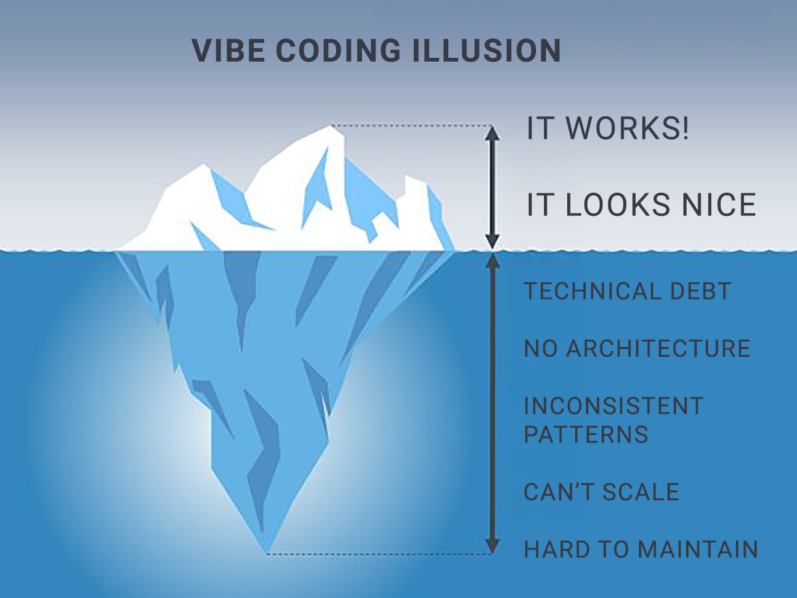

# Reality Check: Prototype vs Production

Alright, so we've built our notes app prototype. It looks good, it works, we iterated on it a few times. This is great for what it is...a prototype. **This is not production code**. At least if it's a serious project. If you want to deploy and use this yourself or maybe a few friends, then great, but if it's a serious project that you're going to throw time and money behind, you can't create it like this.

Now keep in mind, this course is very opinionated. If someone else created this course, you may be getting a very different message. You could have someone do what we just did. Just more of it. And make that the course. They may call it "Vibe Coding A Real App". You're going to see a lot of this. Because people want your money. They want people that have no tech experience thinking they can create a billion dollar project.

The truth is, anything of substance will be too big and complex to create in a couple prompts in a one-shot platform. If we just wanted this Notes app as our project with no authentication, no database, no payments or anything like that, then fine. However, if you plan on scaling it, you want to create it on your own machine and in incremental steps that you carefully construct and review and test.

## Technical Debt

Technical debt is the future cost of fixing or reworking code that was done quick and dirty instead of done right.

It's a metaphor from finance — you're "borrowing" time now by taking shortcuts, but you'll "pay it back" later with interest. The interest is the extra effort to:

Vibe-coded projects accumulate technical debt fast because:

1. **The AI doesn't know your future**
   It solves the immediate problem without considering where the project is headed. You ask for a user profile, it builds one. You ask for teams later, now you're refactoring because it wasn't built with that in mind.
2. **Inconsistent patterns**
   Ask for 5 features across 5 sessions, you might get 5 different approaches. One uses a custom hook, another inlines the logic, another pulls in a library. None of them are "wrong" but now your codebase has no coherent style.
3. **Over-engineering or under-engineering**
   AI tends to either throw in abstractions you don't need, or hardcode things that should be configurable. Both create debt.
4. **Copy-paste syndrome**
   AI loves to duplicate code with slight variations instead of abstracting. Works fine until you need to change something in 12 places.
5. **Missing edge cases**
   AI optimizes for the happy path. Error handling, loading states, empty states, validation — often shallow or missing entirely.
6. **Dependency bloat**
   AI will casually pull in packages for things you could do in 5 lines. Now you've got 47 dependencies to maintain.

So if you quickly prototype or vibe code a project as your actual production application, often times, you'll get this illusion.

Later when we create our SaaS, the AI will have context of not just the current app, but the plans for the future. We can do this with memory or context files.

We can have custom commands and agents that can do reviews and optimizations. We can have planning agents to shape the idea of what we're building.

I'm not saying we're going to know every line of syntax, but we'll have a handle on the overall architecture and workflow. We don't have any of that right now.

## What This Prototype Was Good For

Don't get me wrong - this prototype served its purpose:

- We validated the concept (yes, a markdown notes app makes sense)
- We tested the UX (split view works, sidebar navigation is intuitive)
- We got a list of basic MVP features
- We saw what the app should look and feel like
- We can show this to stakeholders or potential users for feedback

That's exactly what prototypes are for. Quick validation. User testing. Proof of concept.

## The Right Way to Use Vibe Coding

Here's my rule:

**Use vibe coding for:**

- Quick prototypes (like we just did)
- Testing ideas
- UI mockups
- Throwaway code
- Learning what's possible

**Don't use vibe coding for:**

- Production applications
- Code you need to maintain
- Anything with users' data
- Projects you're launching as a business

## Moving Forward

In the next section, we're going to build a notes app the right way. We're going to use Claude Code, but we're going to be involved in every step. We're going to:

1. Plan the features properly
2. Set up the project structure correctly
3. Build features incrementally
4. Review all the code that's generated
5. Test as we go
6. Deploy it properly

And most importantly, you're going to understand what's happening at every step.

The prototype we just built took 5 minutes. The proper version will take a few hours. But that proper version will be something you can actually maintain, extend, and deploy with confidence.

That's the difference between vibe coding and professional AI-assisted development.

Let's get into it.
