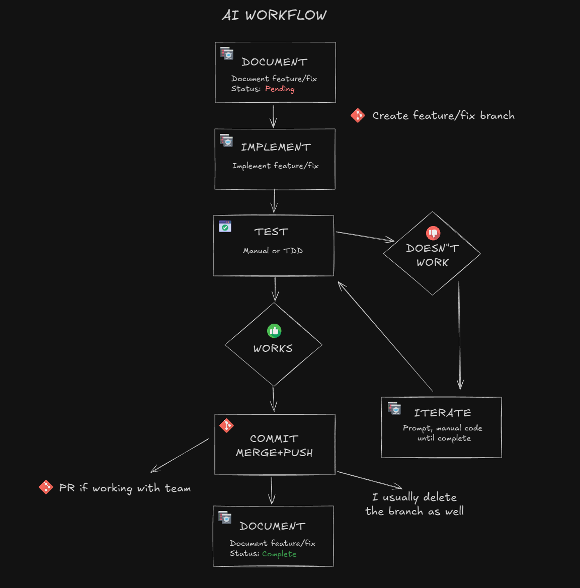

# AI Workflow & Current Feature

In this lesson, I want to establish our ongoing AI workflow. Meaning, when we have a feature or a fix, what exactly do we want it to do? Everything you do should be structured as opposed to willy nilly vibe coding, which if you can't tell by now, I despise.

## The Process

This is the process or workflow that I like to use, however you may find that you change this a bit when you start to work on your own:



The very first thing I like to do when we decide to work on a new feature is document the feature that we'll be working on and what that entails.

We'll have a living document that always has the feature we are working on at `context/current-feature.md`. This will also have a list of the completed features. So this is a nice map of what you've done that is kept right in your context. We will create and format this file after we finish going over the workflow.

Next, we write or build. This is where you prompt your AI to do whatever it is. If it is a large, in-depth feature, I will put the meat of the feature in a document called a **feature spec** and then prompt the AI to read the document and put it into the `current-feature.md` file. We will even have a custom command to do this later.

I always like to create a new branch, whether that's a feature or a fix or whatever else we're doing. This is just good practice whether you are using AI or not. Same goes for most if not all of this.

After it's implemented, you want to test. It will be manual testing at first but later we will integrate unit testing with Vitest.

Next, if it doesn't work or something is off, you're going to iterate and make changes and repeat.

Once it does give you the result you want, you're going to commit your code to the branch. If you were working on a team, this is where you'll make a PR.

Once we commit to the branch, we merge with main. Then I usually delete the old branch.

Then we push to production and test the production version.

Once everything is done, I mark the feature complete in the document.

I also suggest doing periodic reviews of certain features as well as your entire codebase and look for security issues, optimization, duplicate code, unused code and bugs in general.

## Our `current-feature.md` File

Let's create a new file at **@context/current-feature.md**. This will be our feature doc that will always change as we work on different things. Add the following:

```markdown
# Current Feature

<!-- Feature Name -->

## Status

<!-- Not Started|In Progress|Completed -->

Not Started

## Goals

<!-- Goals & requirements -->

## Notes

<!-- Any extra notes -->

## History

<!-- Keep this updated. Earliest to latest -->

- Project setup and boilerplate cleanup
```

I like to have a status at the bottom and a running list of what's been done.

So instead of "vibe coding", we are the architect of our project. Not just having the AI spit out whatever it feels. It is still higher level than manual code, but it makes you much more connected to your project. We're also going to automate this process of loading, starting, testing, reviewing and completing a feature.

So now we have the main 4 files that we always have in context because they are referenced in the `CLAUDE.md` file, which is our memory across sessions.

- project-overview.md
- ai-interactions.md
- coding-standards.md
- current-feature.md
